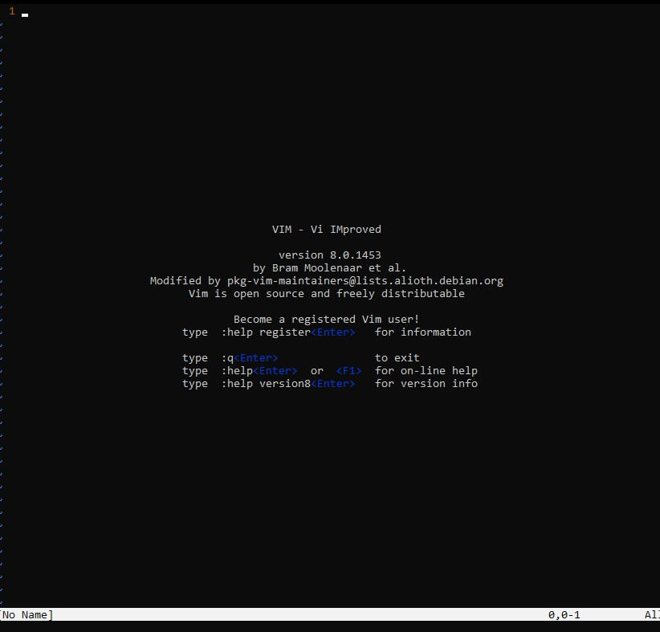

# Vim

## Install

Usually Vim is install in your Linux system no matter the distro, but to check if it is installed:

```bash
vim
```

 in shell/bash and a popup screen with a version number is shown like this one



If it is not installed, enter the following to install it:

```bash
sudo apt-get install vim
```

Enter your password and proceed

The first and only prompt has a series of install options. Go for the first and default option **1**


## Basics

Vim is a powerful yet frustrating tool for beginners. Some ideas are not intuitive for the average user. 

The biggest change from a normal IDE or text editor is that Vim has different modes. Upon opening with:

```bash
vim fileNameHere.txt
```

you will have entered **normal** mode.


In normal mode, you can move through the document, but editing is reserved for editing mode. 

**Editing** mode is where you will spend most of your time and as the name implies, you can edit the text in this mode. To enter this mode, press "**i**".

To go back to normal, press "**Ctrl-C**"


To **exit** Vim press \<esc\> and enter 

```vim
:q
OR
:quit
```

However, this does not save the document

to save you must write to the file

```
:wq
```

As seen above, once you press \<esc>, you enter into Vim's bash command. All commands start with "**:**" at the start of the line


Sometimes, saving can be stubborn so don't be afraid to force push with an "**!**" after the command (joking but true)


\* Note: this guide was only tested on **Ubuntu** however, other distros should be nearly identical

## Movement

Movement is primarily done in normal mode and the keys to move are h, j, k, and l

* h - left
* j - down
* k - up
* l - right
* w - start of word
* e - end of word
* 0 - end of line

To go to a specific line, enter 

```
:2 #or some other line number
```

 in the Vim command to get to that line


To see a full list of shortcuts goto https://vim.rtorr.com/


\* Note, these keys are abnormal to use for many people, so Vim gives you the options to remap keys

## Remapping keys

To remap your must end the following

```vim
:imap jj <esc>
```

This mapping is from jj -> \<esc>, therefore jj will actually be esc for Vim


Of course, when you change this in your file, it will only effect the local file. To change it globally, you must enter

```
vi ~/.vimrc
```

This will open a file that effects all vim instances from now on


For my Vim settings, goto the [following link](https://gist.github.com/Zeyu-Li/73e30eddbde493bd3c329de57c658a55)

OR

copy the following

```
set nu
set ai
set tabstop=4
set ls=2
set autoindent
imap jj <esc>
```

These settings make it so the lines are numbered, the line is auto indented at 4 spaces and that jj is mapped to \<esc>


## Notes

These are the basics of Vim, but definitely not an entire review of Vim, so take your time and go through some of the resources below. Thanks for viewing and if you have any feedback or suggestions, open an issue


## Resources

Vim cheat sheet: https://vim.rtorr.com/

Video:

* MIT's Missing Semester: https://www.youtube.com/watch?v=a6Q8Na575qc